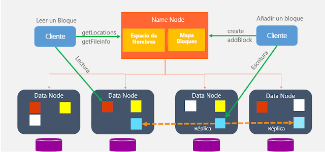
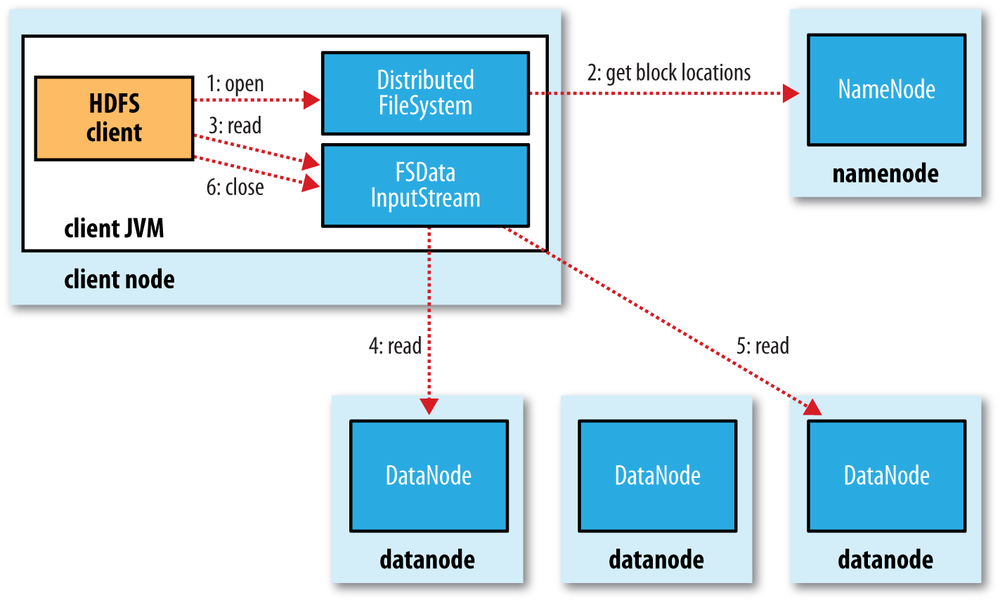
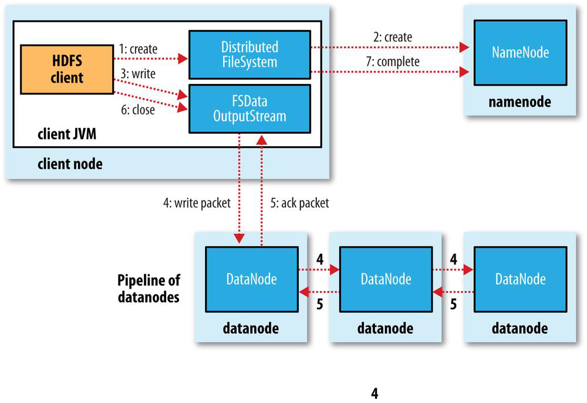
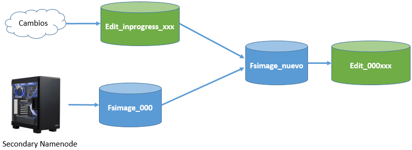
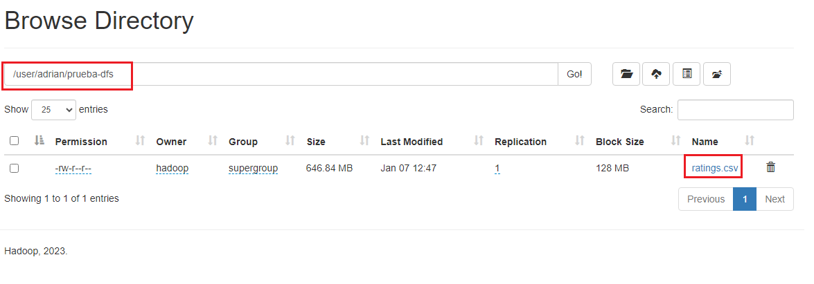
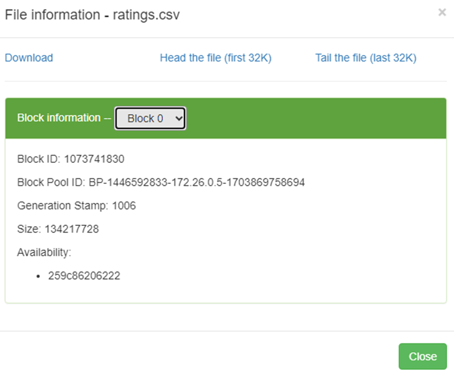
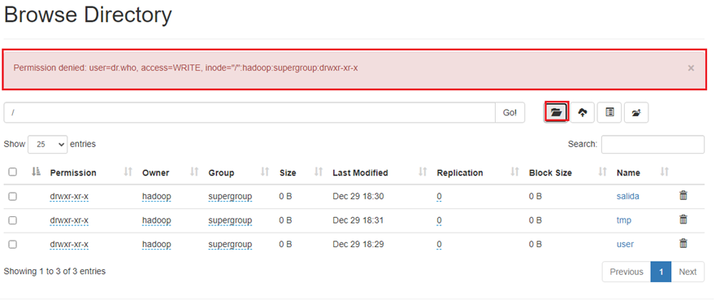

# HDFS
## Uso básico
Para interactuar co almacenamento utilízase o comando hdfs. Isto admite un parámetro ou subcomando con diferentes opcións.
```bash
hdfs comando
```
Para interactuar co sistema de ficheiros Hadoop, utilízase o parámetro dfs, que require outro argumento (que comeza por "-") que se corresponderá con algúns dos comandos básicos de bash.
```bash
hdfs dfs -comando_linux
```
Exemplo:
```bash
hdfs dfs ls
```
Comandos mais usados:
- **-put**: coloca un ficheiro en *HDFS*.
- **-get** (ou *copyToLocal*): recupera un ficheiro de *HDFS* ao noso sistema local.
- **-cat** / **-text**: amosa o contido dun ficheiro.
- **-head**: amosa o principio dun ficheiro.
- **-tail**: amosa o final dun ficheiro.
- **-mkdir**: crea un directorio.
- **-rmdir**: elimina un directorio.
- **-count**: conta o número de elementos (número de cartafoles/ficheiros...).
- **-cp**: copia un ficheiro.
- **-mv**: move ou renomea un ficheiro.
- **-rm**: elimina un ficheiro.

## Namenodes e Datanodes
Esquema da arquitectura de *HDFS*:

### Namenode
Como mencionamos, hai dous tipos de *namenodes*. O primeiro é coñecido como **Namenode principal**. Só hai un, e actúa como servidor principal.
- Nodo ao que os clientes teñen que conectarse para realizar lecturas/escrituras.
- Mantén a árbore do sistema de ficheiros (espazo de nomes) e os metadatos de todos os ficheiros e directorios da árbore, polo que sabe en que nodo do clúster está cada bloque de información (mapa de bloques).
- Os metadatos gárdanse tanto na memoria (para axilizar o seu uso) como no disco ao mesmo tempo, polo que é un nodo que require moita memoria RAM.
- Os bloques nunca pasan polo NameNode, transfírense entre DataNodes e/ou o cliente. É dicir, o Namenode non é responsable de almacenar ou transferir os datos.
- Se cae, non hai acceso a HDFS, polo que é fundamental manter as copias de seguridade.

O segundo tipo é coñedido como **Namenode Secundario** (*Secondary Namenode*):
- A súa función principal é gardar unha copia dos seguintes metadatos:
  - *FSImage*: instantánea dos metadatos do sistema de ficheiros.
  - *EditLog*: rexistro de transaccións que contén información sobre cada cambio que se produce nos *metadatos* do sistema de ficheiros.
- Non é unha copia do *Namenode*.
- Adoita executarse nunha máquina distinta.
### Datanode
Haberá máis dun nodo deste tipo en cada clúster. Para cada Namenode podemos ter miles de Datanodes.
- Almacena e le bloques de datos.
- Recuperado polos clientes do Namenode.
- Informan ao Namenode da lista de bloques almacenados.
- Poden ir en discos diferentes.
- Gardan unha suma de verificación.



## Proceso de lectura
Nun proceso de lectura os datos fúen da seguinte forma:

1.	cliente abre o ficheiro que quere ler mediante o método open() do sistema de ficheiros distribuído.
2.	Chama ao namenode a través dun RPC (chamada de procedemento remoto) que lle indica a localización do primeiro bloque do ficheiro. Para cada bloque, o namenode devolve o enderezo dos datanodes que teñen unha copia dese bloque. Ademais, os datanodes ordénanse en función da súa proximidade ao cliente (depende da topoloxía da rede e da implantación no centro de datos/rack/nodo). Se o propio cliente é un datanode, a lectura farase dende o seu propio sistema local.
3.	sistema de ficheiros distribuído devolve ao cliente un FSDataInputStream (un fluxo de entrada que admite a busca de ficheiros), no que se invoca a lectura mediante o método read(). Este fluxo, que contén os enderezos dos nodos de datos para os primeiros bloques do ficheiro, conéctase ao nodo de datos máis próximo para ler o primeiro bloque.
4.	Os datos lense dende o datanode con chamadas ao método read(). Cando se leu todo o bloque, o fluxo de entrada pechará a conexión co nodo de datos actual e buscará o mellor nodo de datos para o seguinte bloque.
5.	paso anterior repítese (sempre de forma transparente para o cliente, que só está lendo datos dun fluxo de datos continuo).
6.	Cando o cliente remata de ler, pecha a conexión ao fluxo de datos.

## Proceso de escritura
A escritura segue un proceso semellante:


1.	O cliente crea o ficheiro chamando ao método create() do DistributedFileSystem.
2.	Fai unha chamada RPC ao namenode para crear o ficheiro no sistema de ficheiros do namenode, sen ningún bloque asociado a el. O namenode realiza varias comprobacións para garantir que o ficheiro non existe previamente e que o usuario ten os permisos necesarios para crealo. Despois diso, o namenode determina como dividirá os datos en bloques e que nodos de datos utilizará para almacenar os bloques.
3.	O DistributedFileSystem devolve un FSDataOutputStream que xestiona a comunicación cos datanodes e o namenode para que o cliente comece a escribir os datos de cada bloque no namenode apropiado.Conforme el cliente escribe los datos, el flujo obtiene del namenode una lista de datanodes candidatos para almacenar las réplicas. La lista de nodos forma un pipeline, de manera que si el factor de replicación es 3, habrá 3 nodos en el pipeline. El flujo envía los paquetes al primer datanode del pipeline, el cual almacena cada paquete y los reenvía al segundo datanode del pipeline. Y así sucesivamente con el resto de nodos del pipeline.
4.	Cando todos os nodos teñan confirmado a recepción e almacenamento dos paquetes, envíe un paquete de confirmación ao fluxo.
5.	Cando o cliente remata de escribir os datos, pecha o fluxo mediante o método close() que libera os paquetes restantes á canalización de datanode e agarda a recibir confirmacións. Unha vez confirmado, indícalle ao namenode que se rematou a escritura, informando os bloques finais que compoñen o ficheiro (poden ter cambiado en comparación co paso 2 se houbo un erro de escritura).HDFS por dentro
## HDFS por dentro
HDFS utiliza de un conxunto de ficheiros que xestionan os cambios que se producen no clúster.
Primeiro entramos en $HADOOP_HOME/etc/hadoop e averiguamos o cartafol de datos que temos configurado en hdfs-site.xml para o namenode:
- **hdfs-site.xml**
```xml
<property>
    <name>dfs.name.dir</name>
    <value>file:///opt/hadoop-data/hdfs/namenode</value>
</property>

```

Se non se especifica ningún valor para a propiedade dfs.name.dir, por defecto a información almacenarase en /tmp/hadoop-$user/dfs/name (onde $user representa o nome de usuario), como é o caso (user = raíz).
Desde o noso sistema de ficheiros, accedemos a dito cartafol e vemos que hai un cartafol actual que conterá un conxunto de ficheiros cuxos prefixos son:
- *edits_000NNN*: histórico de cambios que se van producindo.
- *edits_inprogress_NNN*: cambios actuaIs en memoria que non se persistiron todavía.
- *fsimagen_000NNN*: snapshot en tempo real do sistema de ficheiros.

Cando se inicia HDFS, o último ficheiro fsimage dispoñible cárgase na memoria xunto coas edicións que non foron procesadas. Usando o namenode secundario, cando se enche un bloque, sincronizaranse os cambios que se produzan en edits_inprogress, creando unha nova fsimage e unha nova edición.

Así, cada vez que se reinicie o namenode, os ficheiros de rexistro de fsimage e edicións fusionaranse.
### Bloques
Para comprender o funcionamento interno de HDFS e a xestión dos bloques, imos traballar cun ficheiro suficientemente grande para ocupar máis dun bloque (dispoñible na aula virtual). Para este exemplo, descomprimimos o ficheiro e movemos ratings.csv a HDFS.

```bash
hdfs dfs -mkdir /user/adrian/prueba-hdfs
hdfs dfs -put ratings.csv /user/adrian/prueba-hdfs
```

Se queremos saber cantos bloques se crearon e canto ocupa cada un, podemos utilizar o comando fsck. As opcións -files e -blocks fan que se mostre a información do ficheiro e do bloque.

```bash
hdfs fsck /user/adrian/prueba-hdfs -files -blocks
```

Tamén pode usarse a interfaz gráfica de Hadoop (http://localhost:9870/explorer.html#/), Tras localizar o arquivo obtemos o Block Pool ID.



Ao despregar o *combobox* podemos ver os diferentes bloques:



## Administración
Algunhas das opcións máis útiles para administrar HDFS

- **`hdfs dfsadmin -report`**: Realiza un resumo do sistema HDFS, similar ao que aparece na interface web, onde podemos comprobar o estado dos diferentes nodos.  
- **`hdfs fsck`**: Comproba o estado do sistema de ficheiros. Se queremos comprobar o estado dun determinado directorio, indicarémolo mediante un segundo parámetro: `hdfs fsck /datos/prueba`  
- **`hdfs dfsadmin -printTopology`**: Amosar a topoloxía, identificando os nodos que temos e o rack ao que pertence cada un.  
- **`hdfs dfsadmin -listOpenFiles`**: Comproba se hai algún ficheiro aberto.  
- **`hdfs dfsadmin -safemode enter`**: Pon o sistema en modo seguro, evitando así a modificación dos recursos do sistema de arquivos.  
- **`hdfs dfsadmin -safemode leave`**: Sae do modo seguro.

### Snapshots
Usando snapshots podemos crear unha instantánea que almacene como está o noso sistema de ficheiros nun momento determinado, como copia de seguridade dos datos, para poder realizar unha recuperación no futuro.

O primeiro paso é activar o uso de snapshots, mediante o comando de administración, indicando en que cartafol imos habilitar o seu uso:

```bash
hdfs dfsadmin --allowSnapshot /user/adrian/datos
hdfs dfs -createSnapshot /user/adrian/datos snapshot1
```

Esta captura crearase dentro dun directorio oculto dentro da ruta indicada (/user/adrian/datos/.snapshot/snapshot1/). 

Se se realiza algún cambio no directorio pódese restaura-la snapshot co seguinte comando:

```bash
hdfs dfs -cp /user/adrian/datos/.snapshot/snapshot1/ejemplo.txt /user/adrian/datos
```

Se queremos saber que cartafoles soportan as instantáneas:

```bash
hdfs lsSnapshottableDir
```

Finalmente, se queremos desactivar as instantáneas dun cartafol determinado, primeiro debemos eliminalas e despois desactivalas:

```bash
hdfs dfs -deleteSnapshot /user/adrian/datos snapshot1
hdfs dfsadmin -disallowSnapshot /user/adrian/datos
```

### HDFS GUI
Se intentamos crear un directorio a través da interfaz gráfica diranos que non hai permisos.



Podemos solucionar esto cambiando os permisos mediante liña de comandos:

```bash
hdfs dfs -mkdir /user/adrian/probas
hdfs dfs -chmod 777 /user/adrian/probas
```

## Referencia dos principais comandos de HDFS

### 1. `hdfs dfs`
É o comando máis usado para **interactuar co sistema de ficheiros distribuído HDFS**.  
Permite crear, listar, copiar e eliminar ficheiros ou directorios, de forma similar aos comandos de Linux.

**Sintaxe xeral:**  
`hdfs dfs [opcións]`

**Opcións principais:**
- `-ls [ruta]`: Lista os ficheiros e directorios nunha ruta.  
- `-mkdir [ruta]`: Crea un novo directorio.  
- `-put [ficheiro_local] [ruta_hdfs]`: Copia un ficheiro local ao HDFS.  
- `-get [ficheiro_hdfs] [ruta_local]`: Descarga un ficheiro do HDFS.  
- `-cat [ficheiro]`: Amosar o contido dun ficheiro.  
- `-cp [orixe] [destino]`: Copia ficheiros dentro do HDFS.  
- `-mv [orixe] [destino]`: Move ou renomea ficheiros.  
- `-rm [ficheiro]`: Elimina un ficheiro.  
- `-rm -r [directorio]`: Elimina un directorio recursivamente.

---

### 2. `hdfs dfsadmin`
Usado para **administrar e supervisar o clúster HDFS**, xestionando o estado, topoloxía e modo seguro.

**Sintaxe xeral:**  
`hdfs dfsadmin [opción]`

**Opcións máis comúns:**
- `-report`: Mostra un informe detallado do clúster.  
- `-printTopology`: Mostra a topoloxía de racks e DataNodes.  
- `-safemode enter | leave | get`: Xestiona o modo seguro.  
- `-setBalancerBandwidth <bytes>`: Axusta o ancho de banda do balanceador.  
- `-refreshNodes`: Recarga a lista de DataNodes.  
- `-listOpenFiles`: Lista os ficheiros actualmente abertos.

---

### 3. `hdfs fsck`
Ferramenta de **verificación da integridade do sistema de ficheiros**.  
Comproba se hai bloques perdidos ou corrompidos.

**Sintaxe:**  
`hdfs fsck [ruta] [opcións]`

**Opcións comúns:**
- `-files`: Mostra os ficheiros comprobados.  
- `-blocks`: Mostra información dos bloques.  
- `-locations`: Mostra onde se atopan os bloques.  
- `-openforwrite`: Mostra ficheiros abertos para escritura.  
- `-delete`: Elimina bloques corrompidos.  

**Exemplo:**  
`hdfs fsck /datos/prueba -files -blocks -locations`

---

### 4. Outros comandos útiles

- **`hdfs balancer`**: Redistribúe bloques entre DataNodes para equilibrar o uso do espazo.  
- **`hdfs namenode`**: Operacións de mantemento do NameNode (formateo, recuperación).  
- **`hdfs datanode`**: Mantemento de DataNodes (execución, rollback).  
- **`hdfs dfs -du` / `-df`**: Consulta o uso do espazo en HDFS.  
- **`hdfs snapshot`**: Crea e xestiona snapshots (copias de estado).  
- **`hdfs mover`**: Recoloca datos entre tipos de almacenamento segundo políticas.

---

### 5. Resumo rápido

| Comando | Función principal | Uso típico |
|----------|-------------------|-------------|
| `hdfs dfs` | Xestión de ficheiros e directorios | Copiar, listar, borrar |
| `hdfs dfsadmin` | Administración do clúster HDFS | Modo seguro, topoloxía |
| `hdfs fsck` | Verificación da integridade | Comprobar bloques |
| `hdfs balancer` | Balancear carga de nodos | Redistribuír bloques |
| `hdfs namenode` | Mantemento do NameNode | Formateo, recuperación |
| `hdfs datanode` | Mantemento de DataNodes | Execución, rollback |
| `hdfs snapshot` | Xestión de snapshots | Copias de estado |
| `hdfs mover` | Recolocación de datos | Políticas de almacenamento |

## Referencias e recursos sobre HDFS

1. **Apache Hadoop - Documentación oficial de HDFS**  
   [https://hadoop.apache.org/docs/current/hadoop-project-dist/hadoop-hdfs/HdfsUserGuide.html](https://hadoop.apache.org/docs/current/hadoop-project-dist/hadoop-hdfs/HdfsUserGuide.html)  
   Guía oficial do usuario de HDFS, con explicación detallada dos comandos, arquitectura e configuración.

2. **Hadoop: The Definitive Guide (Tom White, O'Reilly Media)**  
   Libro clásico e de referencia sobre Hadoop e HDFS, con explicacións prácticas e teóricas sobre o ecosistema Hadoop.

3. **HDFS Architecture Guide (Apache Foundation)**  
   [https://hadoop.apache.org/docs/current/hadoop-project-dist/hadoop-hdfs/HdfsDesign.html](https://hadoop.apache.org/docs/current/hadoop-project-dist/hadoop-hdfs/HdfsDesign.html)  
   Documento técnico que describe o deseño interno de HDFS: bloques, réplicas, NameNode e DataNodes.

4. **Cloudera Documentation – HDFS Overview**  
   [https://docs.cloudera.com/cdp-private-cloud-base/7.1.7/hdfs-overview/topics/hdfs-introduction.html](https://docs.cloudera.com/cdp-private-cloud-base/7.1.7/hdfs-overview/topics/hdfs-introduction.html)  
   Referencia práctica de Cloudera sobre o funcionamento, administración e monitorización de HDFS en contornos empresariais.

5. **IBM Developer – Introduction to the Hadoop Distributed File System**  
   [https://developer.ibm.com/articles/os-cn-hadoop-hdfs/](https://developer.ibm.com/articles/os-cn-hadoop-hdfs/)  
   Artigo divulgativo que explica o funcionamento de HDFS e a súa importancia no procesamento distribuído de datos.


